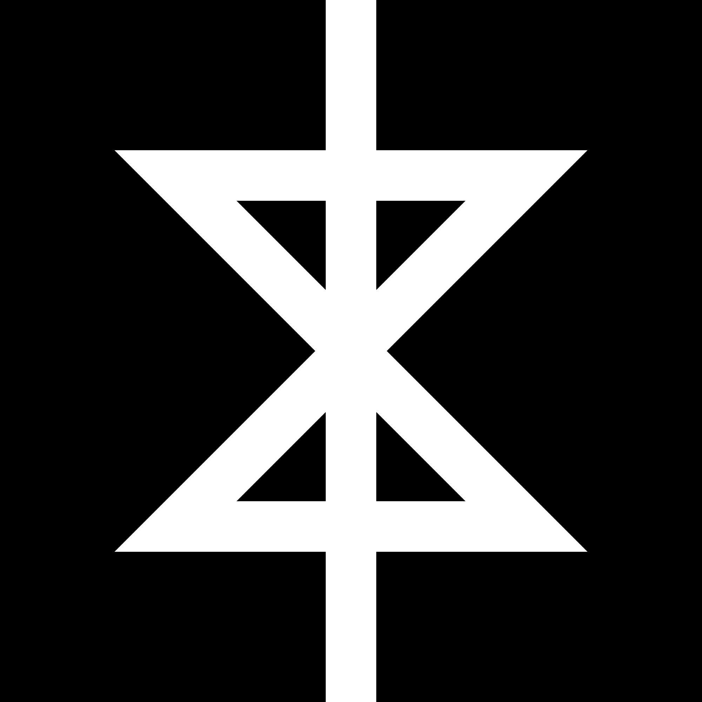

# Iconography

In this document you will find a list of all approved iconography, as well as
examples. The examples provided are only merely on incarnation of the
represented icon, any sufficiently accurate illustration or other rendering is
equally valid.

## The Obsolist Cross
</img> 
The Obsolist Cross doubles as both an hourglass and two opposing arrows. Representing the uncompromising march of time and the stagnant battle of progress and regression.

## The Inverted Cross
</img> 
Traditionally representing the humility of Peter the Apostle's crucifixion, the inverted cross has been adopted by the occult in recent years to represent the opposition of Christianity. While its exact message depends on the context and the viewer's interpretation, its meaning in regards to Obsolism is clear. It represents the direct opposition to the tyranny of Christianity and its perverse infiltration of our culture and government.

## The Inverted Pentagram
</img> 
The Inverted Pentagram is synonymous with most forms of Satanism and the occult. It's less directly offensive than the Inverted Cross and has been depicted numerous times in popular media and culture. While the popularity and beauty of this symbol may tempt you into using it to represent Obsolism, this is forbidden as the Church has its own icon, the Obsolist Cross. Alternatively, it *is* encouraged to use this where the symbol is not the focus or primary element of an art piece or document.
